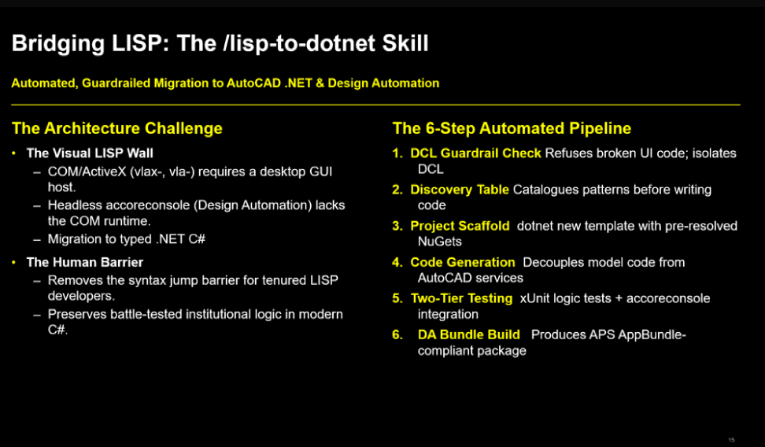

# lisp-to-dotnet (WIP)

Claude Code skill that migrates AutoLISP (`.lsp`) plugins into AutoCAD .NET C# for **Design Automation**. AutoLISP's COM/ActiveX runtime (`vla-`/`vlax-`) doesn't exist in the headless DA engine — this skill reads a `.lsp` file, maps every command/entity op/DXF access/COM call to its .NET equivalent, and generates a full DA-ready plugin: source, unit tests, `accoreconsole` integration tests, and a deployable bundle.

Details: [`skill/SKILL.md`](skill/SKILL.md) · Architecture/status: [`SPEC.md`](SPEC.md)

## Get started

```sh
git clone https://github.com/autodesk-platform-services/aps-lisp-dotnet-skill.git
cd aps-lisp-dotnet-skill
cp -r skill ~/.claude/skills/lisp-to-dotnet
dotnet new install skill/templates/acad-lisp-migration
claude "/lisp-to-dotnet <your-file>.lsp"
```

## Before / after



- `before.mp4` — desktop AutoLISP, interactive
- `after.mp4` — Design Automation, headless, cloud

Design-Automation-only by construction — every migrated command is parameterized and non-interactive, no desktop/interactive output.

_More docs coming — this README is a work in progress._
