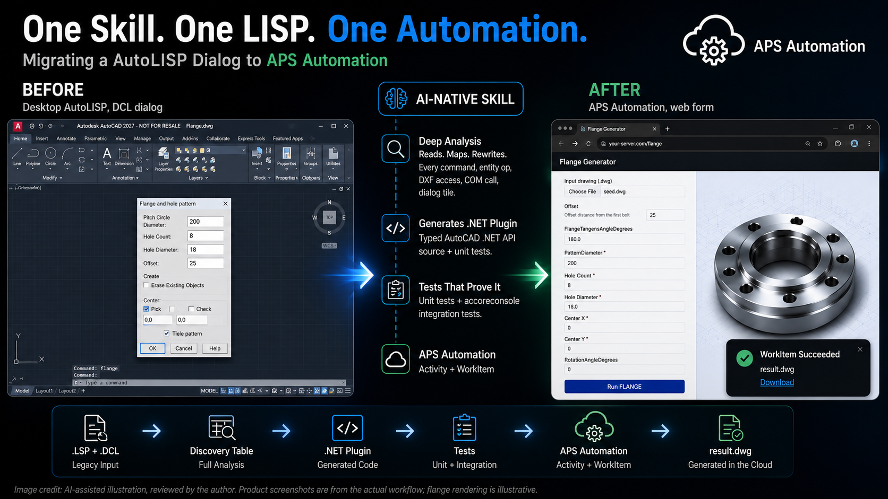

# lisp-to-dotnet


*Image credit: AI-assisted illustration, reviewed by the author. Product screenshots are from the actual workflow; flange rendering is illustrative.*

Claude Code skill that migrates AutoLISP (`.lsp`) plugins into AutoCAD .NET C# for **Design Automation**. AutoLISP's COM/ActiveX runtime (`vla-`/`vlax-`) doesn't exist in the headless DA engine — this skill reads a `.lsp` file, maps every command/entity op/DXF access/COM call to its .NET equivalent, and generates a full DA-ready plugin: source, unit tests, `accoreconsole` integration tests, and a deployable bundle.

Details: [`skill/SKILL.md`](skill/SKILL.md) · Architecture/status: [`SPEC.md`](SPEC.md)

**Preview release** — actively tested against real AutoLISP and real APS Design Automation, but still evolving. Issues, suggestions, and pull requests are all welcome.

## Validated

- **5 independent real APS Design Automation deploys** — not simulated, each a real WorkItem against the live cloud service.
- **62/62 real-world `.lsp` files** (jtbworld.com corpus) produced a correct Discovery Table, no silent skips.
- **7/7 full migrations** passed (scaffold → codegen → build → unit tests) — found and fixed 3 real bugs in the skill itself along the way.
- **One-shot install** — `/plugin marketplace add` → `/plugin install` — tested end-to-end on a fresh machine.

## Install

For using the skill as-is — no cloning, no manual copying:

```
/plugin marketplace add https://github.com/autodesk-platform-services/aps-lisp-dotnet-skill.git
/plugin install lisp-to-dotnet@aps-lisp-dotnet-skill
/reload-plugins
```

`/reload-plugins` is required after install — without it the skill won't show up in the current session.

## Usage

1. Create a working folder and put your `.lsp` file in it — and its `.dcl`, if the project has one:

   ```
   mkdir C:\LispToDotnet
   cd /d C:\LispToDotnet
   ```

2. Launch Claude Code from that folder:

   ```
   claude
   ```

3. Invoke the skill, naming the `.lsp` file — mention the `.dcl` too if the project has one:

   ```
   /lisp-to-dotnet your-file.lsp
   ```

The skill takes it from there: DCL check, Discovery Table, `dotnet new` template registration (one-time, resolved automatically to wherever the plugin is actually installed — no path to guess), scaffold, code generation, build, tests — prompting you at each side-effecting step (build/test/deploy commands) rather than running them silently.

## Setup (for contributors)

For editing the skill's own source (`SKILL.md`, templates, references):

```sh
git clone https://github.com/autodesk-platform-services/aps-lisp-dotnet-skill.git
cd aps-lisp-dotnet-skill
cp -r skill ~/.claude/skills/lisp-to-dotnet
dotnet new install skill/templates/acad-lisp-migration
```

Edit under `skill/`, then re-copy to `~/.claude/skills/lisp-to-dotnet` to pick up changes (no separate build step).

## Before / after


### Before — desktop AutoLISP, interactive

https://github.com/user-attachments/assets/2c023344-1b21-48b6-9202-943a0ed8e2fa

### After — Design Automation, headless, cloud

https://github.com/user-attachments/assets/fefd7898-95d9-444d-8f91-c97f600e589e

Design-Automation-only by construction — every migrated command is parameterized and non-interactive, no desktop/interactive output.

## Credits

Written with Claude Code — human-directed, human-reviewed, and tested end-to-end against real APS Design Automation, not accepted on faith. Every real bug in this skill's own guidance (see `SKILL.md`'s Known Edge Cases) was found through actual testing, not by construction.

The 64-file test corpus (`lisps/`) that this skill was validated against is real-world AutoLISP by Jimmy Bergmark, [JTB World](https://jtbworld.com/autolisp-visual-lisp) — decades of genuinely useful, freely-shared LISP routines, and reuse is explicitly welcomed on the site itself: *"Please feel free to be inspired, cut&paste or if you have any feedback, questions or looking for an AutoLISP programmer for small or large projects go here."* Several of the corpus's real bugs and edge cases (found and fixed as part of validating this skill) trace back to these files — thank you for keeping them public.

---

**Written By**
Madhukar Moogala (APS)
